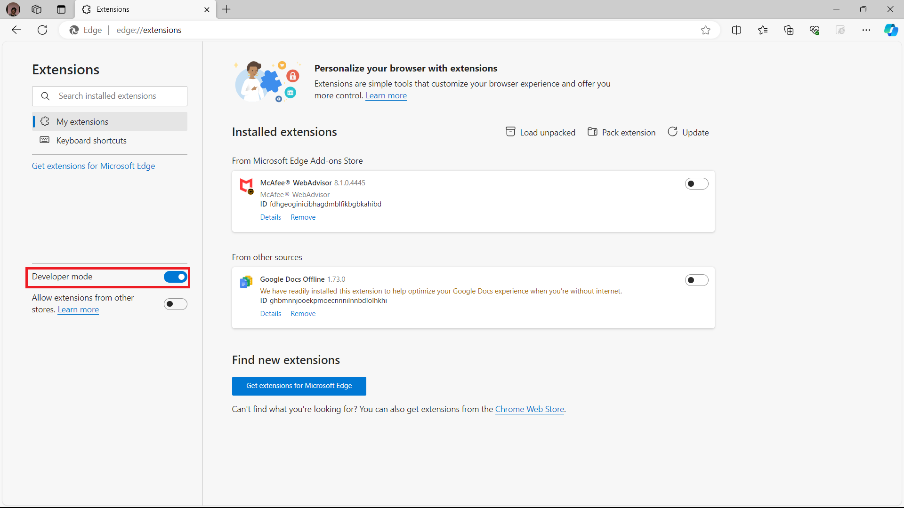
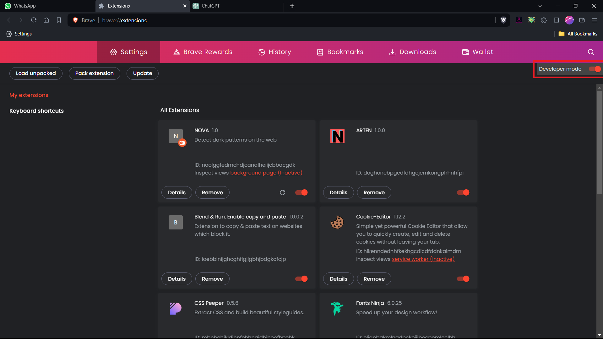
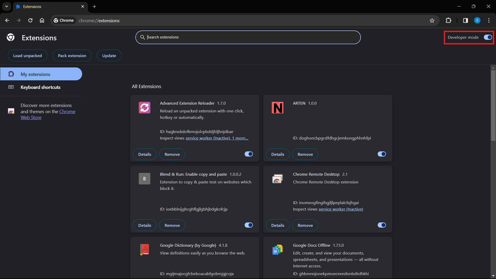
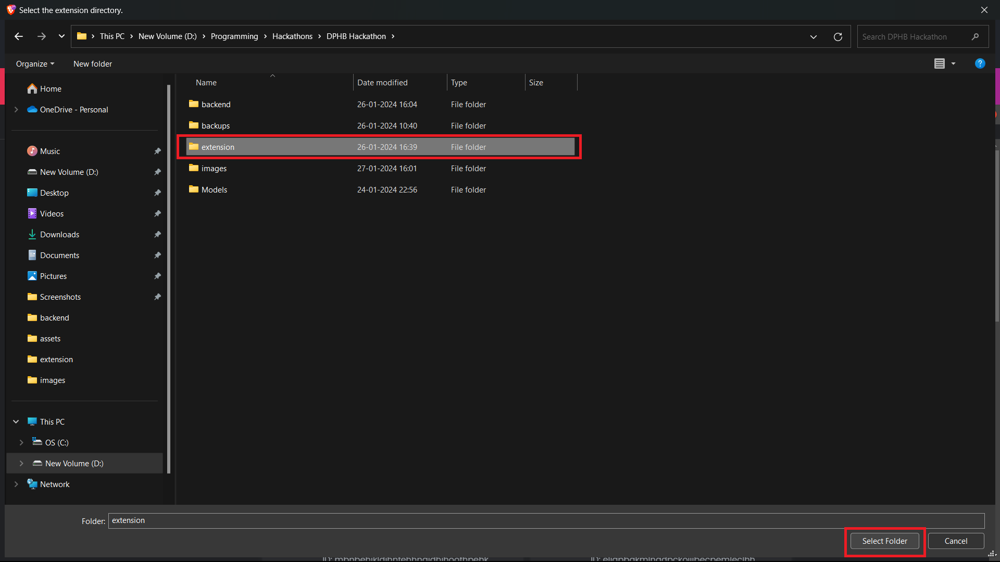
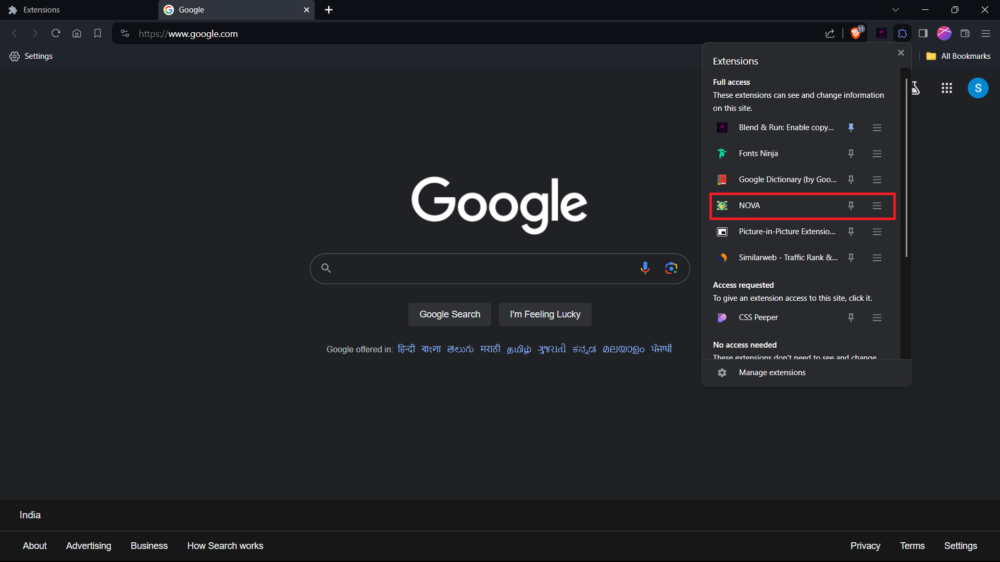

# Chrome Extension Setup

## Prerequisites

- Chromium Based Borwser like chrome, brave, or edge.

## Getting Started

1. **Download and Extract the Project:**

    - Find the zip file attached in the email.
    - Download the attached zip file to your local machine.
    - Extract the contents of the zip file to a directory of your choice.

2. **Load the Extension:**

    - Open the browser and go to `<browser_name>://extensions/`.
    - Enable "Developer mode" using the toggle switch in the top right corner.

    ## Edge
    

    ## Brave
    
    
    ## Chrome
    

    - Click on the **Load unpacked** button.
    - Select the directory where you extracted the project files and click **Select Folder.**
  
    

3. **Verify the Extension:**

    - The extension with name **NOVA** should now appear in the list of installed extensions.
    - Ensure that the extension is enabled.

    

4. **Test the Extension:**

    - Open a website in Google Chrome.
    - Locate the extension icon in the toolbar.

https://github.com/PreranaYekkele/DPBH/assets/66351075/4cb62686-0db4-4a3b-9680-a2684b07693b
