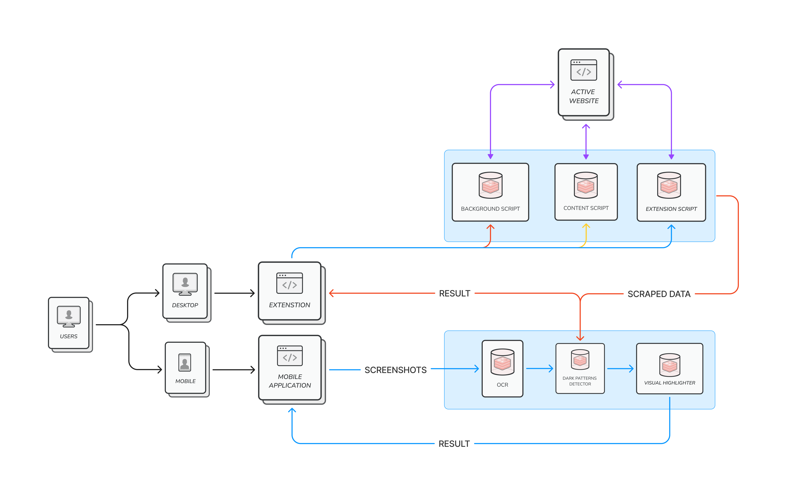

# System Architecture

Here's the working of our **Chrome Extension** and **Mobile Application**

### Extension Architecture Overview:

1. **User Interaction:**
   - The user interacts with the extension by clicking on the extension icon in the Chrome browser.

2. **Popup (popup.html, popup.js, style.css):**
   - The popup is responsible for initiating the detection process.
   - It sends a command to the background script to start the detection.

3. **Background Script (background.js):**
   - Listens for commands from the popup.
   - Initiates the detection process by sending a message to the content script.

4. **Content Script (content.js):**
   - Injected into the currently active webpage.
   - Scrapes data from the webpage using Depth First Search Approach to extract information about the HTML elements (tags, text, id, class, location, height, width).
   - Compiles the extracted data into a JSON format.
   - Sends the JSON data to the server for dark pattern detection.

5. **Server (Cloud Hosted):**
   - Hosted in the cloud to handle dark pattern detection using machine learning models.
   - Receives JSON data from the content script.
   - Processes the data using the dark pattern detection model.
   - Sends back a response containing information about detected dark patterns, including their type, count, and specific texts identified as dark patterns.

6. **Content Script (Continued):**
   - Receives the response from the server.
   - Parses the response and extracts information about dark patterns.
   - Highlights the identified dark pattern elements on the webpage.
   - Sends a message to the popup to display the results.

7. **Popup (Continued):**
   - Receives the message from the content script with the detected dark pattern details.
   - Renders the results in a user-friendly format, showing the type and count of dark patterns.
   - Displays any relevant texts identified as dark patterns.

### Data Flow:

1. User initiates detection in the popup.
2. Popup sends a command to the background script.
3. Background script sends a message to the content script.
4. Content script scrapes and compiles data, then sends it to the server.
5. Server processes the data, runs dark pattern detection, and sends results back.
6. Content script receives the results and highlights dark patterns on the webpage.
7. Content script sends a message to the popup with the detected dark pattern details.
8. Popup displays the results to the user.

This architecture allows for a clear separation of concerns between different components of your extension, making it modular and easy to maintain. It ensures effective communication between the extension and the server for dark pattern detection.

## Interacting with Mobile Application:

**1. Screenshot Analysis:**
   - Users initiate the process by uploading a screenshot, triggering a robust Optical Character Recognition (OCR) process within the mobile app.

**2. OCR and Text Extraction:**
   - The OCR algorithm performs advanced text extraction, converting screenshot content into a structured format.

**3. Data Encoding with Base64:**
   - Extracted text data is encoded using Base64 for secure and efficient transmission to the centralized Python server.

**4. Data Transmission:**
   - Base64-encoded text data and the original image are securely transmitted to the Python server, ensuring data integrity.

**5. Machine Learning-driven Image Analysis:**
   - Advanced machine learning algorithms on the server side process the Base64-encoded text data and concurrently analyze the screenshot image for dark patterns.

**6. Dynamic Image Modification:**
   - If dark patterns are identified, the Python server dynamically modifies the image, emphasizing detected dark patterns while preserving the original context.

**7. Modified Image Transmission:**
   - The enhanced image, along with any additional data, is transmitted back to the mobile application, completing the feedback loop.

**8. Data Decoding with Base64:**
   - Upon receiving the server response, the mobile application decodes any Base64-encoded data, ensuring accurate interpretation and display.

**9. User Insight Delivery:**
   - Users receive the modified image, providing visual insights into the presence of dark patterns within the uploaded screenshot.

