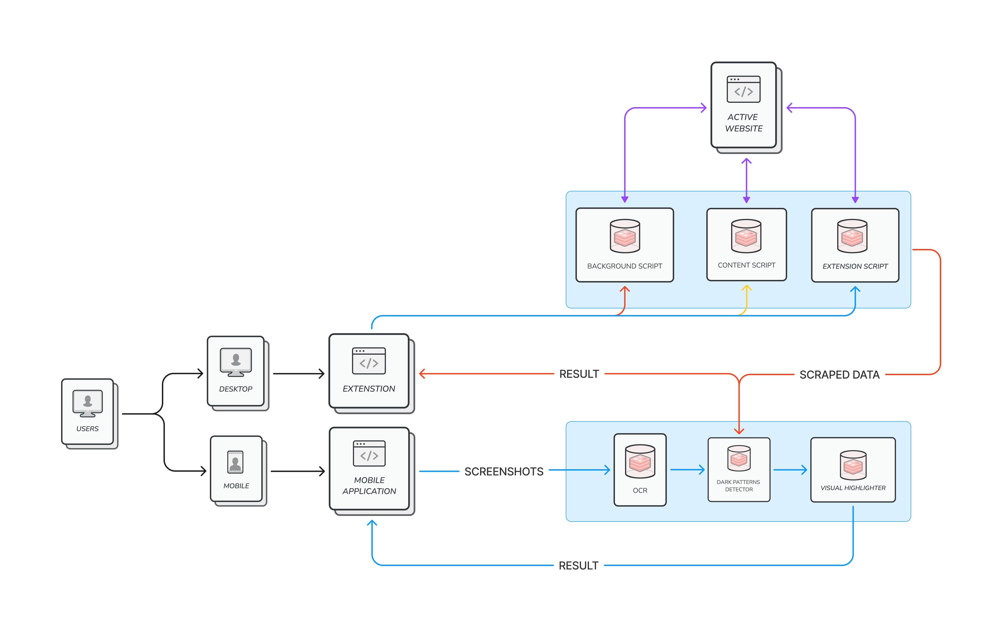
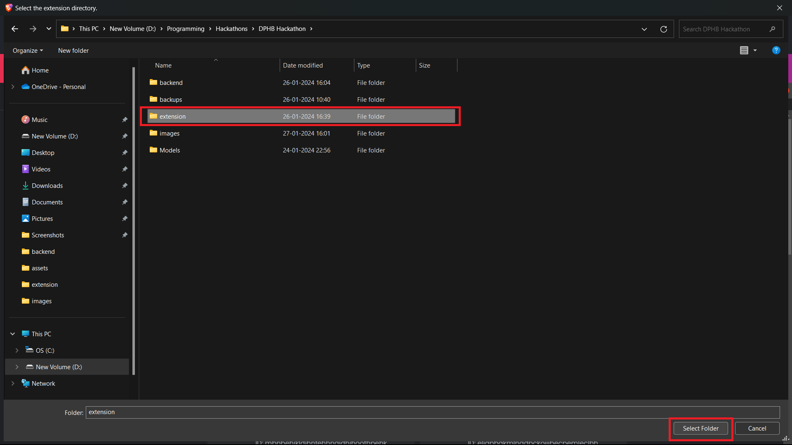

### Chrome Extension:

*1. User Action:*
   - The user activates the Chrome extension and clicks on the "Detect Patterns" button while browsing a website.

*2. Extension Action:*
   - The Chrome extension, equipped with web scraping capabilities, begins the process of dynamically analyzing the webpage for potential dark patterns.

*3. Automated Web Scraping:*
   - Leveraging its automated web scraping capabilities, the extension meticulously extracts relevant data and page elements from the website.

*4. Data Processing and Compression:*
   - The extracted data is processed within the extension, and a compressed version is prepared for efficient transmission.

*5. Data Transmission:*
   - The compressed data is transmitted securely from the Chrome extension to the centralized Python server.

*6. Machine Learning Analysis:*
   - On the server side, sophisticated machine learning models analyze the data to discern the presence of dark patterns, leveraging insights gained from the training of the models.

*7. Highlighting Dark Patterns:*
   - Identified dark patterns are communicated back to the Chrome extension, which dynamically highlights the detected dark patterns on the website in real-time.

*8. Real-time User Feedback:*
   - Users receive real-time feedback within their browser, empowering them with insights into the presence of potential dark patterns as they navigate the website.

### Mobile Application:

*1. User Action:*
   - Users open the mobile application, opting to analyze a screenshot for dark patterns.

*2. Screenshot Analysis:*
   - Users upload a screenshot, triggering a robust Optical Character Recognition (OCR) process within the mobile app.

*3. OCR and Text Extraction:*
   - The OCR algorithm performs advanced text extraction, converting the content within the screenshot into a structured format.

*4. Data Encoding with Base64:*
   - To ensure secure and efficient data transmission, the extracted text data is encoded using Base64 before being sent to the centralized Python server.

*5. Data Transmission:*
   - The Base64-encoded text data and the original image are transmitted securely to the Python server, maintaining data integrity throughout the process.

*6. Machine Learning-driven Image Analysis:*
   - Advanced machine learning algorithms on the server side process the Base64-encoded text data and concurrently analyze the screenshot image for dark patterns.

*7. Dynamic Image Modification:*
   - If dark patterns are identified, the Python server dynamically modifies the image, accentuating the detected dark patterns while preserving the original context.

*8. Modified Image Transmission:*
   - The enhanced image, along with any additional data, is transmitted back to the mobile application, completing the feedback loop.

*9. Data Decoding with Base64:*
   - Upon receiving the response from the server, the mobile application decodes any Base64-encoded data, ensuring accurate interpretation and display.

*10. User Insight Delivery:*
   - Users receive the modified image, providing them with visual insights into the presence of dark patterns within the uploaded screenshot.

# Chrome Extension

This README provides instructions on how to run and test the Chrome Extension locally.

## Prerequisites

- Chromium Based Borwser like chrome, brave, or edge.

## Getting Started

1. **Download and Extract the Project:**

    - Find the zip file attached in the email.
    - Download the attached zip file to your local machine.
    - Extract the contents of the zip file to a directory of your choice.

2. **Load the Extension:**

    - Open the browser and go to `<browser_name>://extensions/`.
    - Enable "Developer mode" using the toggle switch in the top right corner.

    ## Edge
    

    ## Brave
    
    
    ## Chrome
    

    - Click on the **Load unpacked** button.
    - Select the directory where you extracted the project files and click **Select Folder.**
  
    

3. **Verify the Extension:**

    - The extension with name **NOVA** should now appear in the list of installed extensions.
    - Ensure that the extension is enabled.

    

4. **Test the Extension:**

    - Open a website in Google Chrome.
    - Locate the extension icon in the toolbar.

https://github.com/PreranaYekkele/DPBH/assets/66351075/4cb62686-0db4-4a3b-9680-a2684b07693b

